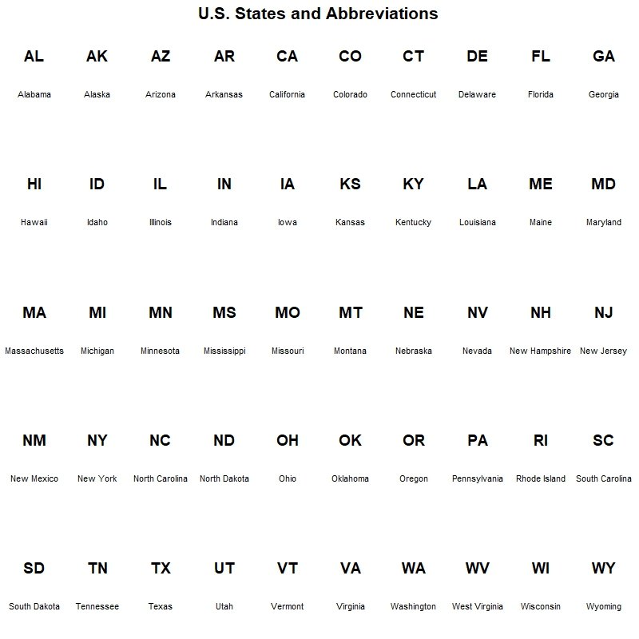
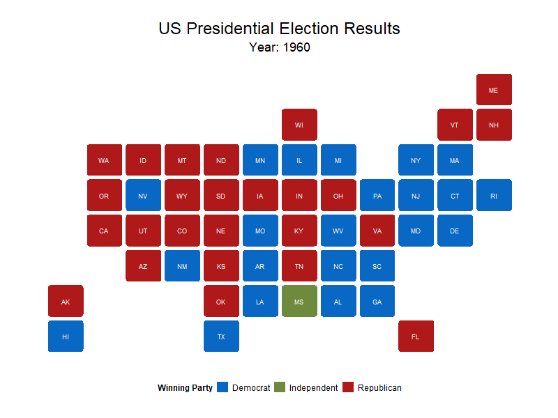
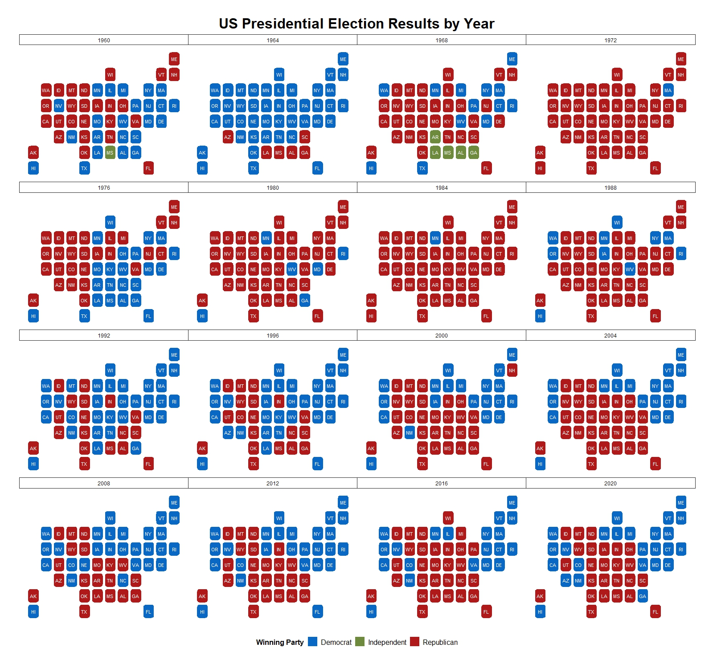
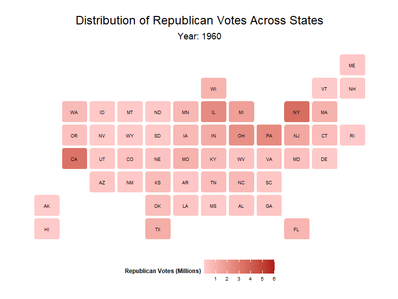
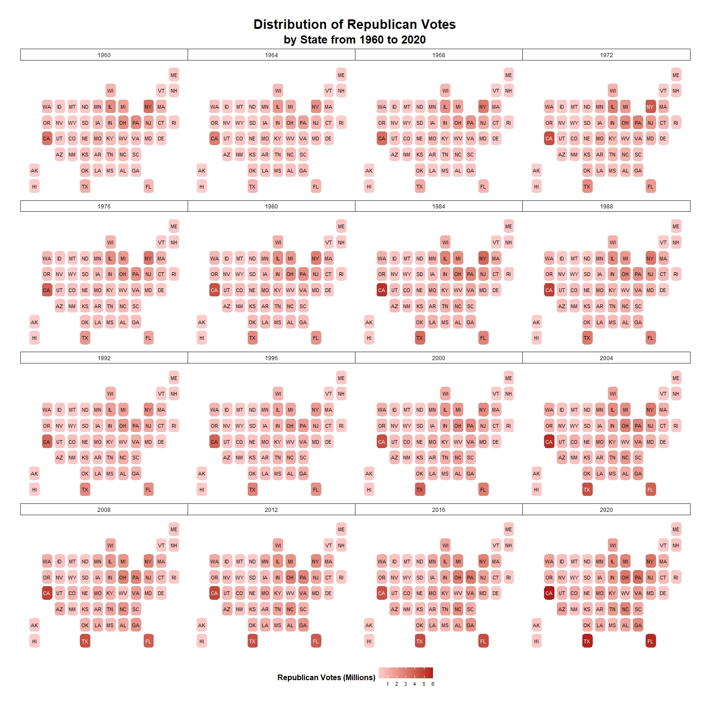
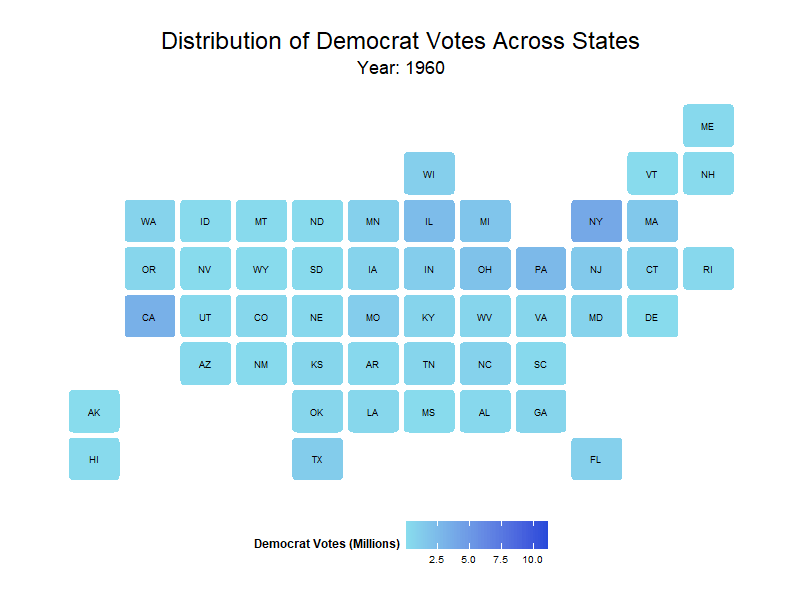
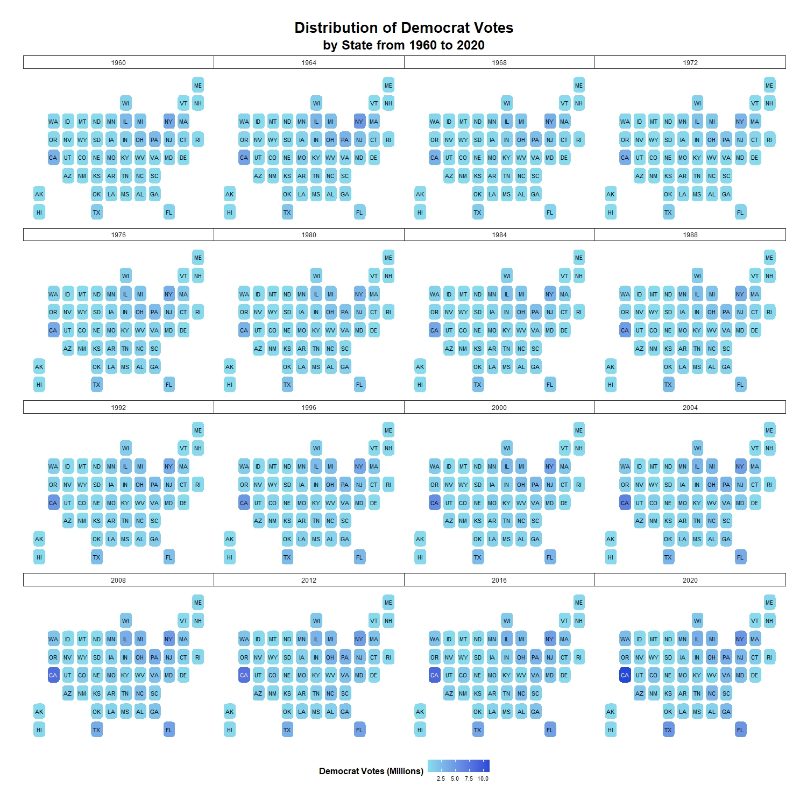

The US Presidential Election is the world's most significant and widely watched election. It is so significant that the outcome of selecting a president in the presidential election can affect the global economy and geopolitics. 

President Donald Trump's election victory in 2016 saw him and his adminstration taking harder stance with foreign partners and enemies from geopolitics to trade to international agreements. Some examples included trade-war with China and clashing with NATO allies over not meeting their mandatory defence spending of 2% of their GDP. President Ronald Reagan election victory saw the end of the Cold War with the Soviet Union, introduction of Reaganomics based on the principles of supply-side economics and the trickle-down theory and higher military spending. The 600-navy ship plan was the flagship of President Reagan's higher military spending.  

Democrat Presidents like President Barack Obama oversaw the mission that killed Osama Bin Laden, repsonsible for September 11 attacks and weathered the US through the storm during the 2008 Great Recession.

Drawing inspiration from the <a href="https://www.washingtonpost.com/wp-srv/special/business/states-most-threatened-by-trade/"> Washington Post </a>, this page showcases animations of the US Presidential Election results, share of republican and democrat voters from 1960 to 2020. Lastly a facet grid view of the election results and share of republican and democrat voters will be shown below.  

----

**State Abbreviations**

---

**US Presidential Elections results from 1960 to 2020**    

 |  

---

**Facet grid of US President Election Results from 1960 to 2020**

---

**Distribution of Republican Voters across States from 1960 to 2020**

----

**Facet grid of Republican Voters across State from 1960 to 2020**

----

**Distribution of Democrat Voters across States from 1960 to 2020**

----

**Facet grid of Democrat Voters across State from 1960 to 2020**

----

**References and Inspirations**

* Work is inspired by the <a href="https://www.washingtonpost.com/wp-srv/special/business/states-most-threatened-by-trade/"> Washington Post </a> for showing an alternative choropleth visualisation.
* Code and package installing from <a href="https://github.com/hrbrmstr/statebins?tab=readme-ov-file/"> hrbmster </a>
* Data Source from <a href="https://www.presidency.ucsb.edu/statistics/elections/2020/"> The Amercian Presidency Project </a>

