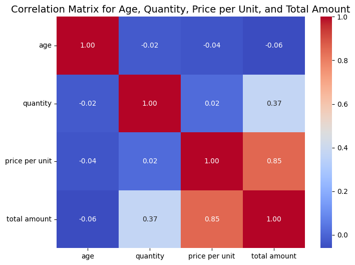
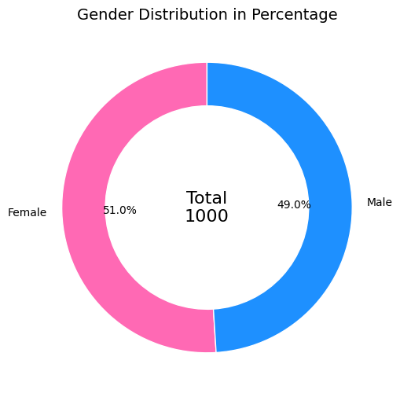
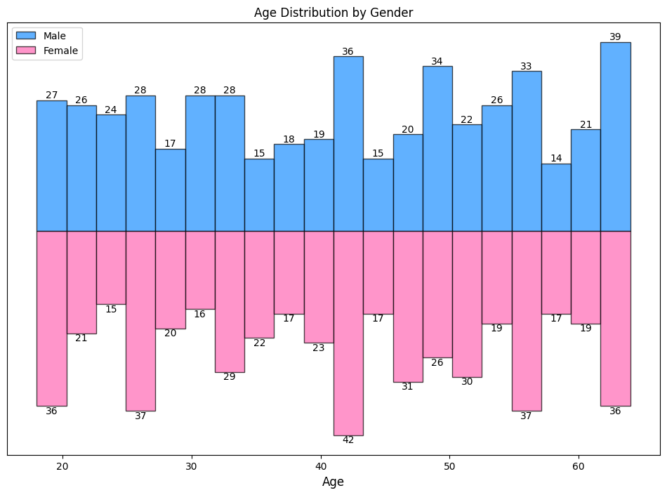
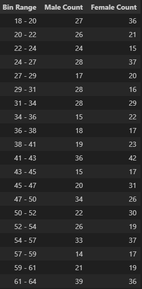
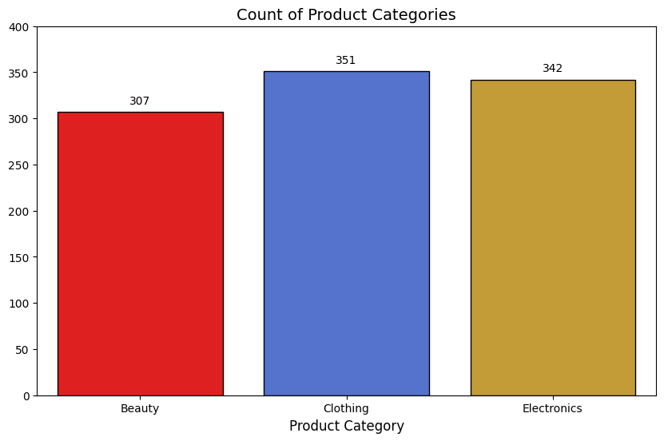
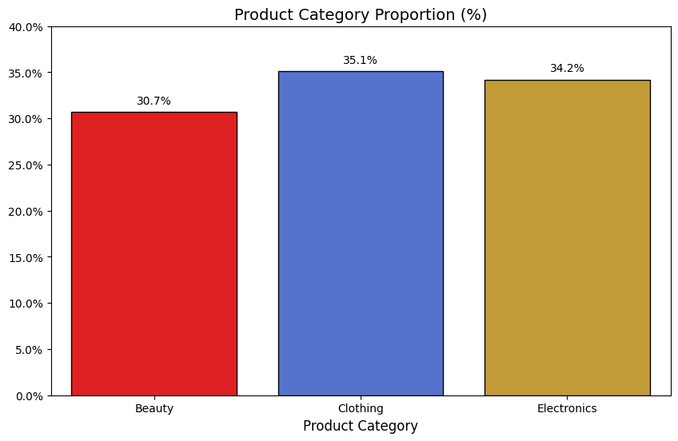

# Exploratory Data Analysis and Basic Statistical Modelling with Python

This is a simple exercise using retail sales data obtained from <a href="https://www.kaggle.com/datasets/mohammadtalib786/retail-sales-dataset/"> Kaggle </a>. The main objective of this simple exercise is to firstly gain exposure to python programming and demonstrate competency using python programming in performing exploratory data analysis and basic statistical modelling.

## Table of Contents
- [Importing libraries and data](#importing-libraries-and-data)
- [Data Examination and cleaning](#data-examination-and-cleaning)
- [Data Visualisation and Storytelling](#data-visualisation-and-storytelling)
- [Basic Statistical Modelling](#basic-statistical-modelling)


---
## Importing libraries and data

```python
import pandas as pd
from pandasgui import show
import matplotlib.pyplot as plt
import seaborn as sns
import numpy as np
import pandas as pd
import seaborn as sns
from matplotlib.ticker import FuncFormatter
from sklearn.model_selection import train_test_split
from statsmodels.api import OLS, add_constant
from statsmodels.stats.outliers_influence import variance_inflation_factor
from statsmodels.stats.stattools import durbin_watson
from statsmodels.stats.diagnostic import het_breuschpagan

# Import CSV file based on file directory
df = pd.read_csv("C:/Users/weiki/practice datasets/retail_sales_dataset.csv")
```

---

## Data Examination and cleaning

Starting off, retail sales data set is examined to view the column names, data summary, information about the data frame, row and column numbers. PandasGui is used to view the entire data frame.

```python
print(df.head())        # View the first 5 rows
print(df.info())        # Get information about the DataFrame
print(df.describe())    # Get summary statistics
print(df.columns)       # View the column names
print(df.shape)         # View the shape of the DataFrame

# Launch the pandasgui interface with your DataFrame
show(df)
```

```
   transaction id        date customer id  gender  age product category  \
0               1  2023-11-24     CUST001    Male   34           Beauty   
1               2  2023-02-27     CUST002  Female   26         Clothing   
2               3  2023-01-13     CUST003    Male   50      Electronics   
3               4  2023-05-21     CUST004    Male   37         Clothing   
4               5  2023-05-06     CUST005    Male   30           Beauty   

   quantity  price per unit  total amount  
0         3              50           150  
1         2             500          1000  
2         1              30            30  
3         1             500           500  
4         2              50           100  
<class 'pandas.core.frame.DataFrame'>
RangeIndex: 1000 entries, 0 to 999
Data columns (total 9 columns):
 #   Column            Non-Null Count  Dtype 
---  ------            --------------  ----- 
 0   transaction id    1000 non-null   int64 
 1   date              1000 non-null   object
 2   customer id       1000 non-null   object
 3   gender            1000 non-null   object
 4   age               1000 non-null   int64 
 5   product category  1000 non-null   object
 6   quantity          1000 non-null   int64 
 7   price per unit    1000 non-null   int64 
 8   total amount      1000 non-null   int64 
dtypes: int64(5), object(4)
memory usage: 70.4+ KB
None
       transaction id         age     quantity  price per unit  total amount
count     1000.000000  1000.00000  1000.000000     1000.000000   1000.000000
mean       500.500000    41.39200     2.514000      179.890000    456.000000
std        288.819436    13.68143     1.132734      189.681356    559.997632
min          1.000000    18.00000     1.000000       25.000000     25.000000
25%        250.750000    29.00000     1.000000       30.000000     60.000000
50%        500.500000    42.00000     3.000000       50.000000    135.000000
75%        750.250000    53.00000     4.000000      300.000000    900.000000
max       1000.000000    64.00000     4.000000      500.000000   2000.000000
Index(['transaction id', 'date', 'customer id', 'gender', 'age',
       'product category', 'quantity', 'price per unit', 'total amount'],
      dtype='object')
(1000, 9)
```
Based on the results above, the are 9 columns with 1000 rows. Column names are transaction id, date, customer id, gender, age, product category, quantity, price per unit and total amount. All the columns data type except date, customer id, gender and product category are int64. Data type for date, customer id, gender and product category are object. From the data frame description, there are possible anomalies spotted for price per unit as the max and 75% value are 500 and 300 respectively which are exceptionally high compared to the median. Furthermore, the mean value is also notabley high at 179.89, indicating possible outliers influencing the mean value.

```python
# change column names to lowercase
df.columns = [col.lower() for col in df.columns]

# Print the updated DataFrame to check the column names
print(df.head())

# Check for missing values in the DataFrame
print(df.isnull().sum())  # Summarize the number of missing values per column
print(df.duplicated().sum())  # Number of duplicate rows
```

```
   transaction id        date customer id  gender  age product category  \
0               1  2023-11-24     CUST001    Male   34           Beauty   
1               2  2023-02-27     CUST002  Female   26         Clothing   
2               3  2023-01-13     CUST003    Male   50      Electronics   
3               4  2023-05-21     CUST004    Male   37         Clothing   
4               5  2023-05-06     CUST005    Male   30           Beauty   

   quantity  price per unit  total amount  
0         3              50           150  
1         2             500          1000  
2         1              30            30  
3         1             500           500  
4         2              50           100  
transaction id      0
date                0
customer id         0
gender              0
age                 0
product category    0
quantity            0
price per unit      0
total amount        0
dtype: int64
0

```
The first thing to do as part of data cleaning is to change the column names to lower case to ensure consistency. Next, checking for presence of blanks values and duplicates is done which thankfully there is no presence of missing values or duplicate rows detected.

---

## Data Visualisation and Storytelling

 

The picture above is a correlation heat map matrix for columns age, quantity, price per unit and total amount. The main objective is to provide a broad overview which variables in the data have strong relationships with each other, regardless positively or negatively related. Based on the correlation matrix, price per unit and total amount exhibit very strong positive relationship while quantity and total amount exhibit positive but weaker relationship. The rest of the variables are not correlated to each other.

```python
# Selecting only the specified columns: Age, Quantity, Price per Unit, and Total Amount
selected_columns = df[['age', 'quantity', 'price per unit', 'total amount']]

# Calculate the correlation matrix
correlation_matrix = selected_columns.corr()

# Plot the heatmap for the correlation matrix
plt.figure(figsize=(8, 6))
sns.heatmap(correlation_matrix, annot=True, cmap='coolwarm', fmt=".2f")
plt.title('Correlation Matrix for Age, Quantity, Price per Unit, and Total Amount', fontsize=14)
plt.yticks(rotation=0)  # Rotate the labels for the y-axis to be horizontal
plt.show()
```
 

From the doughnut chart above, 51% out of 1000 of people in the retail sales data are female while the remaining 49% are males, indicating that there is a relative balanced amount of customers between the 2 genders.


Mirrored Histogram of Customer's age by gender    |  Table form for Distribution of Customer's age by gender
:-------------------------:|:-------------------------:
  | 


The figure above from the left shows a mirrored histogram showcasing the age distribution between male and female genders. On the right is a table form showcasing the age histogram bin range and its frequency. From the mirrored histogram, both genders exhibit an uneven age distribution in the histogram with notable higher frequency in certain age groups like 41-43 and 61-64.

```python

# Assuming 'df' is your DataFrame with 'age' and 'gender' columns
# Splitting the data into two groups based on gender
male_data = df[df['gender'] == 'Male']['age']
female_data = df[df['gender'] == 'Female']['age']

# Create a new DataFrame to use with seaborn
data = pd.DataFrame({
    'Age': np.concatenate([male_data, female_data]),
    'Gender': ['Male'] * len(male_data) + ['Female'] * len(female_data)
})

# Set figure size
plt.rcParams["figure.figsize"] = (12, 8)

# Plot histogram for Male Age Distribution with frequency
counts_male, bins_male, bars_male = plt.hist(
    male_data, bins=20, color='dodgerblue', alpha=0.7, edgecolor='black', label='Male'
)

# Add labels for each bin for male data
for bar, count in zip(bars_male, counts_male):
    if count > 0:  # Only label bins with counts
        plt.text(bar.get_x() + bar.get_width() / 2, count, int(count), ha='center', va='bottom')

# Prepare data for Female Age Distribution (inverted)
n_bins = 20
counts_female, bins_female = np.histogram(female_data, bins=n_bins)  # Removed density=True to get frequency
counts_female *= -1  # Invert the counts to create a mirror effect
bin_width = np.diff(bins_female)[0]
bin_pos = bins_female[:-1] + bin_width / 2

# Plot inverted histogram for Female Age Distribution with frequency
bars_female = plt.bar(bin_pos, counts_female, width=bin_width, color='hotpink', edgecolor='black', label='Female', alpha=0.7)

# Add labels for each bin for female data
for pos, count in zip(bin_pos, counts_female):
    if count < 0:  # Only label bins with counts
        plt.text(pos, count, int(-count), ha='center', va='top')

# Customizations: remove vertical axis ticks and title
plt.yticks([])  # Remove vertical axis ticks
plt.ylabel('')  # Remove the vertical axis title

# Adding labels and legend
plt.title('Age Distribution by Gender')
plt.xlabel('Age', fontsize=12)
plt.legend()

# Show the graph
plt.show()

# Creating a DataFrame to display bin ranges and corresponding counts for both Male and Female Age Distribution
bin_ranges = [f"{int(bins_male[i])} - {int(bins_male[i+1])}" for i in range(len(bins_male) - 1)]
histogram_table = pd.DataFrame({
    "Bin Range": bin_ranges,
    "Male Count": counts_male.astype(int),  # Convert counts to integers
    "Female Count": abs(counts_female.astype(int))  # Convert counts to positive integers
})

# Display the table
histogram_table
```
 



For product categories, there are 3 product categories which are Beauty, Clothing and Electronics in the retail sales data. Left side of the figure shows bar chart of number of customers who bought products for each product category while the right shows the same chart but measured in percentage. From both charts, clothing is the most popular product category among customers at 35.1%, followed closely by electronics at 34.2% and lastly beauty at 30.7%

```python
# Define custom colors for each product category
custom_palette = {
    'Beauty': 'red',
    'Clothing': 'royalblue',
    'Electronics': 'goldenrod'
}

# Plot for Product Category Distribution
plt.figure(figsize=(10, 6))
ax = sns.countplot(
    x='product category',
    data=df,
    palette=custom_palette,  # Use the custom palette
    edgecolor='black'
)

# Title and axis labels
plt.title('Count of Product Categories', fontsize=14)
plt.ylabel('')  # Remove the vertical axis title
plt.xlabel('Product Category', fontsize=12)
plt.xticks(rotation=0)

# Manually set the y-axis limit
plt.ylim(0, 400)  # Set the limit to 400

# Add labels to each bar
for bar in ax.patches:
    bar_height = bar.get_height()
    if bar_height > 0:  # Only label bars with counts
        ax.annotate(f'{int(bar_height)}', 
                    xy=(bar.get_x() + bar.get_width() / 2, bar_height), 
                    xytext=(0, 5),  # Offset the label slightly above the bar
                    textcoords='offset points', 
                    ha='center', va='bottom', fontsize=10)

# Show the graph
plt.show()
```

```python

# Define custom colors for each product category
custom_palette = {
    'Beauty': 'red',
    'Clothing': 'royalblue',
    'Electronics': 'goldenrod'
}

# Plot for Product Category Distribution
plt.figure(figsize=(10, 6))
ax = sns.countplot(
    x='product category',
    data=df,
    palette=custom_palette,  # Use the custom palette
    edgecolor='black'
)

# Title and axis labels
plt.title('Product Category Proportion (%)', fontsize=14)
plt.ylabel('')  # Change the vertical axis title to "Percentage"
plt.xlabel('Product Category', fontsize=12)
plt.xticks(rotation=0)

# Calculate total count for percentage conversion
total_count = len(df)

# Convert y-axis labels to percentages
ax.yaxis.set_major_formatter(FuncFormatter(lambda y, _: f'{(y / total_count) * 100:.1f}%'))

# Manually set the y-axis limit to 40% of the total count
plt.ylim(0, total_count * 0.4)  # 40% of the total count

# Add labels to each bar as percentages
for bar in ax.patches:
    bar_height = bar.get_height()
    if bar_height > 0:  # Only label bars with counts
        percentage = (bar_height / total_count) * 100
        ax.annotate(f'{percentage:.1f}%', 
                    xy=(bar.get_x() + bar.get_width() / 2, bar_height), 
                    xytext=(0, 5),  # Offset the label slightly above the bar
                    textcoords='offset points', 
                    ha='center', va='bottom', fontsize=10)

# Show the graph
plt.show()
```

---

## Basic Statistical Modelling

The main question to investigate how is dependent variable total amount affected in response to independent variables like price per unit and quantifying the strength of the relationship between the independent and dependeent variables. Earlier in the correlation heat map matrix, it is understood that total amount, price per unit and quantity have strong positive relationships with each other. Using Ordinary least square (OLS) regression, observed relationships between the independent and dependent variables can be assessed whether they are statistically significant. Using p-values, hypotheses test is performed whether certain independent variables have a meaningful effect on the dependent variable.

The first step is to define the independent and dependent variables for the multiple linear regression. independent variables (X) are price per unit and quantity while dependent variable is total amount (Y). Step 2 ensures a robust regression model is created by splitting the data. Hence, ensuring that the model is properly validated, making it more reliable and generalizable for real-world use.

Step 3 adds an intercept value to the regression model while step 4 fits the regression model with OLS using statsmodel library. Step 5 to 7 are tests for multicollinearity, autocorrelation and heteroscedasticity respectively and step 8 prints a summary of the OLS multiple linear regression. 

```python
# Step 1: Define features (X) and target (y), excluding Gender and Product Category
X = df[['price per unit', 'quantity']]
y = df['total amount']

# Step 2: Split the data into training and testing sets
X_train, X_test, y_train, y_test = train_test_split(X, y, test_size=0.2, random_state=42)

# Step 3: Add a constant for the intercept to the training features
X_train_df = add_constant(X_train)

# Step 4: Fit the regression model using statsmodels
model = OLS(y_train, X_train_df).fit()

# Step 5: Perform Multicollinearity Test using VIF
vif_data = pd.DataFrame()
vif_data["Feature"] = X_train_df.columns
vif_data["VIF"] = [variance_inflation_factor(X_train_df.values, i) for i in range(X_train_df.shape[1])]
print("\nVariance Inflation Factor (VIF):")
print(vif_data)

# Step 6: Perform Autocorrelation Test using Durbin-Watson
dw_statistic = durbin_watson(model.resid)
print(f"\nDurbin-Watson Statistic: {dw_statistic}")

# Step 7: Perform Heteroscedasticity Test using Breusch-Pagan
bp_test = het_breuschpagan(model.resid, X_train_df)
print(f"\nBreusch-Pagan Test p-value: {bp_test[1]}")
```

```
                            OLS Regression Results                            
==============================================================================
Dep. Variable:           total amount   R-squared:                       0.854
Model:                            OLS   Adj. R-squared:                  0.853
Method:                 Least Squares   F-statistic:                     2328.
Date:                Tue, 19 Nov 2024   Prob (F-statistic):               0.00
Time:                        22:59:23   Log-Likelihood:                -5434.3
No. Observations:                 800   AIC:                         1.087e+04
Df Residuals:                     797   BIC:                         1.089e+04
Df Model:                           2                                         
Covariance Type:            nonrobust                                         
==================================================================================
                     coef    std err          t      P>|t|      [0.025      0.975]
----------------------------------------------------------------------------------
const           -439.2661     19.687    -22.312      0.000    -477.912    -400.621
price per unit     2.4898      0.040     61.781      0.000       2.411       2.569
quantity         179.7758      6.772     26.547      0.000     166.483     193.069
==============================================================================
Omnibus:                        1.135   Durbin-Watson:                   1.989
Prob(Omnibus):                  0.567   Jarque-Bera (JB):                1.069
Skew:                          -0.089   Prob(JB):                        0.586
Kurtosis:                       3.024   Cond. No.                         699.
==============================================================================

Notes:
[1] Standard Errors assume that the covariance matrix of the errors is correctly specified.

Variance Inflation Factor (VIF):
          Feature       VIF
0           const  6.638995
1  price per unit  1.001528
2        quantity  1.001528

Durbin-Watson Statistic: 1.9892655724160198

Breusch-Pagan Test p-value: 1.972245868496469e-50
```

In step 7, heteroscedasticity is detected as the Breusch-Pagan Test p-value is very small. This indicates presence of unequal variance of the residuals over a range of measured values. To mitigate, robust standard errors is performed below but it will not be able to remove heteroscedasticity completely. This is mainly due to varying price per unit, resulting in unequal variance of residuals over the range of measured values performed. F-statistic should be interpreted with caution due to presence of heteroscedasticity. 

```python
# Step 1: Fit the regression model using statsmodels with robust standard errors
model.robust = OLS(y_train, X_train_df).fit(cov_type='HC3')  # Using 'HC3' for robust standard errors

# Step 2: Print the regression summary
print(model.robust.summary())
```

```
                            OLS Regression Results                            
==============================================================================
Dep. Variable:           total amount   R-squared:                       0.854
Model:                            OLS   Adj. R-squared:                  0.853
Method:                 Least Squares   F-statistic:                     1325.
Date:                Tue, 19 Nov 2024   Prob (F-statistic):          3.42e-254
Time:                        22:59:23   Log-Likelihood:                -5434.3
No. Observations:                 800   AIC:                         1.087e+04
Df Residuals:                     797   BIC:                         1.089e+04
Df Model:                           2                                         
Covariance Type:                  HC3                                         
==================================================================================
                     coef    std err          z      P>|z|      [0.025      0.975]
----------------------------------------------------------------------------------
const           -439.2661     22.422    -19.591      0.000    -483.212    -395.321
price per unit     2.4898      0.056     44.527      0.000       2.380       2.599
quantity         179.7758      8.683     20.704      0.000     162.757     196.794
==============================================================================
Omnibus:                        1.135   Durbin-Watson:                   1.989
Prob(Omnibus):                  0.567   Jarque-Bera (JB):                1.069
Skew:                          -0.089   Prob(JB):                        0.586
Kurtosis:                       3.024   Cond. No.                         699.
==============================================================================

Notes:
[1] Standard Errors are heteroscedasticity robust (HC3)
```
Hypothesis testing is performed for each estimate to assess whether certain independent variables have a meaningful effect on the dependent variable based on its p-value. Let H₀ be the null hypothesis while H₁ is the alternative hypothesis.

For price per unit coefficient:

H₀ (Null Hypothesis): The coefficient for price per unit is equal to zero.

H₁ (Alternative Hypothesis): The coefficient price per unit is not equal to zero

Based on the values obtained for OLS regression, the p-value obtained for price per unit is very small below 0.05 while the estimate obtained is 2.4898. Thus, at 5% significance level, the null hypothesis is rejected and the estimate obtained is statistically significant, indicating that price per unit has a meaningful effect on total amount.

---

For quantity:

H₀ (Null Hypothesis): The coefficient for quantity is equal to zero.

H₁ (Alternative Hypothesis): The coefficient for quantity is not equal to zero

Based on the values obtained for OLS regression, the p-value obtained for quantity is very small below 0.05 while the estimate obtained is 179.7758. Thus, at 5% significance level, the null hypothesis is rejected and the estimate obtained is statistically significant, indicating that quantity has a meaningful effect on total amount.

---

For intercept value:

H₀ (Null Hypothesis): The coefficient for intercept is equal to zero.

H₁ (Alternative Hypothesis): The coefficient for intercept is not equal to zero.

Based on the values obtained for OLS regression, the p-value obtained for intercept is very small below 0.05 while the estimate obtained is -439.2661. Thus, at 5% significance level, the null hypothesis is rejected and the estimate obtained is statistically significant, but not unrealistic as its impossible for total amount to be negative. The estimate value obtained is a mathematical derviation if price per unit and quantity is 0.

---

To conclude this basic statistical modelling, the relationship between price per unit, quantity and total amount is strongly positive and statistically significant. Using hypotheses testing based on p-values obtained indicate independent variables have a meaningful effect on the dependent variable. Heteeroscedasticity is detected in the OLS multiple linear regression model and robust standard errors is performed to mitigate it but it is accepted nontheless due to varying price per unit amount.

